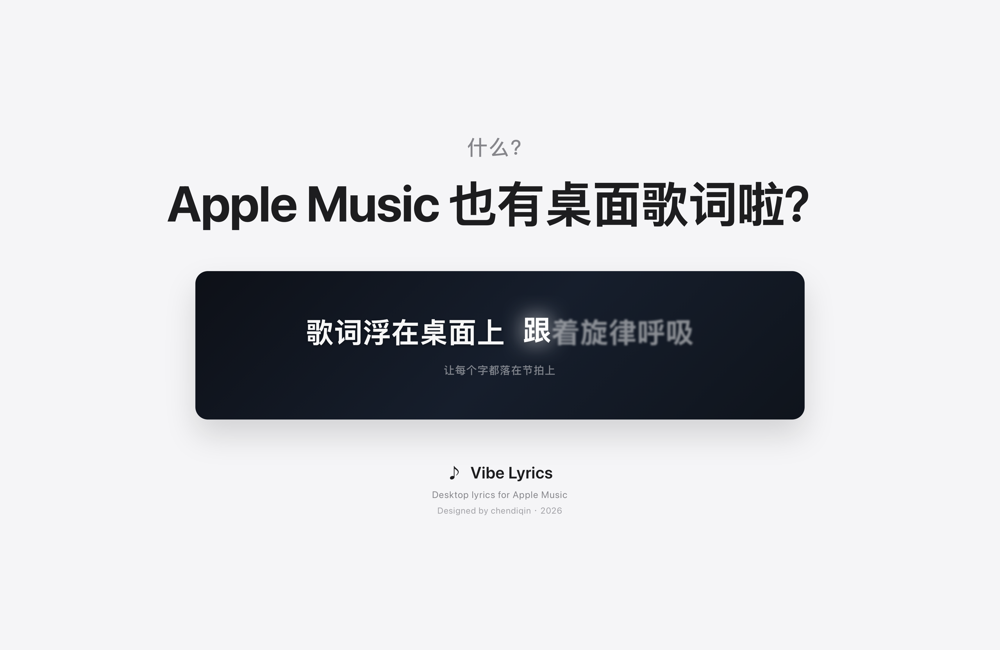

# Vibe Lyrics



Desktop lyrics for Apple Music —— macOS 桌面悬浮歌词，实时联动 Music.app。

纯文字无边框悬浮显示，取 Apple 官方歌词（含逐字时间轴）。逐字歌曲有完整动效：未唱的字是失焦白雾，快唱到前 0.45 秒烟雾聚拢成亮字，唱到时浮起又落下（波浪弧线）伴随辉光，换行以「向上滚动一格」的方式接力。

## 功能

- 菜单栏应用，无 Dock 图标；歌词条置顶悬浮、可拖动
- **智能穿透**：只有鼠标悬在歌词文字附近时才可点击，空白区域的点击直接穿到下层窗口
- Apple 官方歌词（TTML，逐字/逐行自适应），按曲目目录 ID 精确匹配，磁盘缓存
- **官方双语翻译**（歌曲带翻译时显示在主句下方，可关）
- **双击歌词回到本句开头**重唱
- 全局快捷键 ⌥⌘L 一键显示/隐藏
- **设置面板**：字号、歌词颜色（白/金/粉/蓝/薄荷）、预告句开关、时间偏移、开机自启
- 播放时钟：切歌通知 + 每秒轮询 + 本地插值，只进不退

## 构建

```bash
./build.sh install && open "/Applications/Vibe Lyrics.app"
```

需要 Xcode。首次运行：允许「控制音乐」授权，并在弹出的窗口登录 Apple 账户（用你自己的 Apple Music 订阅取歌词）。

## 说明

- 歌词来自 Apple Music 网页版同款接口（非公开），仅供个人使用，不适合上架分发
- 调试日志：`~/Library/Logs/DesktopLyrics.log`（每次启动清空）
- 歌词缓存：`~/Library/Application Support/DesktopLyrics/`
